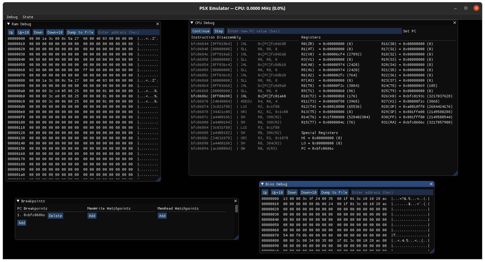

# PSX - Playstation 1 Emulator
This is a hobby project to build on my understanding of emulators and the playstation architecture. This project is currently in a very early state.

## Debug Tools

## Building
### Linux
1. `mkdir build` (or any name you want)  
2. `cd build`  
3. `cmake ..`  
4. `make`
5. `./psx`
