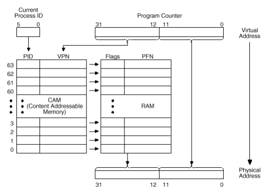

# Memory
http://problemkaputt.de/psx-spx.htm#memorymap
- 2 MB of system memory
- 0x00xxxxxx, 0xA0xxxxxx, 0x80xxxxxx all point to the same physical memory
## PSX Memory Map
| KUSEG | KSEG0 | KSEG1 | Size | Description |
| --- | --- | --- | --- | --- |
| 0x0000_0000 | 0x8000_0000 | 0xA000_0000 | 2048 KB | Main RAM (first 64K reserved for BIOS) |
| 0x1F00_0000 | 0x9F00_0000 | 0xBF00_0000 | 8192 KB | Expansion Region 1 (ROM/RAM) |
| 0x1F80_0000 | 0x9F80_0000 | N/A | 1 KB | Scratchpad (D-Cache used as Fast RAM) |
| 0x1F80_1000 | 0x9F80_1000 | 0xBF80_1000 | 8 KB | I/O Ports |
| 0x1F80_2000 | 0x9F80_2000 | 0xBF80_2000 | 8 KB | Expansion Region 2 (I/0 Ports) |
| 0x1FA0_0000 | 0x9FA0_0000 | 0xBFA0_0000 | 2048 KB | Expansion Region 3 (whatever purpose) |
| 0x1FC0_0000 | 0x9FC0_0000 | 0xBFC0_0000 | 512 KB | BIOS ROM (Kernal) (4096 max) |

### KSEG2
```
|0xFFFE_0000 (KSEG2) | 0.5 KB | I/O Ports (Cache Control) |
```


## Additional Memory (not mapped to the CPU bus)
| Size | Description |
| --- | --- |
| 1024 KB | VRAM (Framebuffers, Textures, Palettes) (with 2KB Texture Cache) |
| 512 KB | Sound RAM (Capture Buffers, ADPCM Data, Reverb Workspace) |
| 0.5 KB | CDROM controller RAM (see CDROM Test commands) |
| 16.5 KB | CDROM controller ROM (Firmware and Bootstrap for MC68HCo5 cpu) |
| 32 KB | CDROM Buffer (IC303) (32Kx8) (BUG: only two sectors accessible?) |
| 128 KB | External Memory Card(s) (EEPROMs) |

## KUSEG, KSEG0, KSEG1, KSEG2 Memory Regions
| Address | Name | Size | Privilege | Code-Cache | Data-Cache |
| --- | --- | --- | --- | --- | --- |
| 0x0000_0000 | KUSEG | 2048 MB | Kernel/User | Yes | (Scratchpad) |
| 0x8000_0000 | KSEG0 | 512 MB | Kernel | Yes | (Scratchpad) |
| 0xA000_0000 | KSEG1 | 512 MB | Kernel | No | No |
| 0xC000_0000 | KSEG2 | 1024 MB | Kernel | (No code) | No |

**KUSEG**
- Intended to contain 2GB of virtual mem (on extended MIPS procs), however the PSX doesn't support virtual mem
- Instead is simply contains a mirror of KSEG0/KSEG1 (in first 512MB) (Trying to access rest causes exception)


**KSEGX**
- KSEG1 is normal physical memory (uncached)
- KSEG0 is a mirror (but with cache enabled)
- KSEG2 is normally used to contain virtual kernel mem, but in PSX it contains Cache Control I/O Ports

## Data Cache (Scratchpad)
- normally, the MIPS CPU would have a Data Cache
- in PSX, it is misused as "Scratchpad"
- Mapped at 1F80_0000..1F80_03FF
- Used as "Fast RAM" instead of cache

## Memory Mirrors
512MB KUSEG, KSEG0, KSEG1 regions are mirrors of each other
**Additional Mirrors inside 512 regions**
- 2MB RAM can be mirrored to the first 8MB (enabled by default)
- 512K BIOS ROM can be mirrored to the last 4MB (disabled by default)
- Expansion hardware (if any) may be mirrored within expansion region
- The seven DMA Control Registers at 1F80_10x8 are mirrored to 1F80_10xC

The size of RAM, BIOS, Expansions regions can be configured by software, for Expansion Region it's also possible to change base address.
- The Scratchpad is mirrored only in KUSEG and KSEG0, not in KSEG1

## Virtual Memory
### Regions
- KUSEG is physical memory space.
	- Consists of 2MB which is mirrored into the three other KSEGX
	- allows for kernel having direct access to user mem regions
- KSEG0 is translated to a virtual linear 2MB region starting from physical address 0x0000_0000
	- all references through this segment are cacheable
	- the 3 MSBits = 0b100...
	- Can switch to PM by changing MSBits to 0b000...
- KSEG1 is a linear 2MB region pointing to the same physical address at 0x0000_0000
	- references through this region are NOT cacheable
	- the 3 MSBits = 0b101...
	- To translate to PM, set 3 MSBits = 0b000...

### Anatomy
VPN: Virtual Page Number
```
----------------------------------------
|                VPN           | Offset |
----------------------------------------
|    |    |    |               |       |
  31   30   29       28-12        11-0  
```
**Bits 31-29**
```
0xx		KUSEG
100		KSEG0
101		KSEG1
```

### Translation Lookaside Buffer (TLB)
- holds 64 entries allowing 64 4KB pages
- Pages are mapped by translating the 20-bit virtual page number (VPN) to the 20-bit physical frame number (PFN)

[source](http://hitmen.c02.at/files/docs/psx/psx.pdf)

## cop0, The System Control Coprocessor

- modified from the original R3000A cop0 architecture with the addition of a few registers and functions
- 16 32-bit control registers
    - memory management
    - system interrupt (exception) management
    - breakpoints

### cop0 Registers

| Number | Mnemonic | Name | Read/Write | Usage |
| --- | --- | --- | --- | --- |
| 0   | INDX | Index | r/w | Index to an entry in the 64-entry TLB file |
| 1   | RAND | Random | r   | Provides software with a "suggested" random TLB entry to be written with the correct translation |
| 2   | TLBL | TBL low | r/w | Provides the data path for operations which read, write, or probe the TLB file (first 32 bits) |
| 3   | BPC | Breakpoint PC | r/w | Sets the breakpoint address to break on execute |
| 4   | CTXT | Context | r   | Duplicates information in the BADV register, but provides this information in a form that may be more useful for a software TLB exception handler |
| 5   | BDA | Breakpoint data | r/w | Sets the breakpoint address for load/store operations |
| 6   | PIDMASK | PID Mask | r/w | Process ID mask |
| 7   | DCIC | Data/Counter interrupt control | r/w | Breakpoint control |
| 8   | BADV | Bad Virtual Address | r   | Contains the address whose reference caused an exception |
| 9   | BDAM | Break data mask | r/w | Data fetch address is ANDed with this value and then compared to the value in BDA |
| 10  | TLBH | TLB high | r/w | Provides the data path for operation which read, write, or probe the TLB file (second 32 bits) |
| 11  | BPCM | Break point counter mask | r/w | Program counter is ANDed with this value and then compared to the value in BPC |
| 12  | SR  | System status register | r/w | Contains all the major status bits |
| 13  | CAUSE | Cause | r   | Describes the most recently recognized exception |
| 14  | EPC | Exception Program Counter | r   | Contains the return address after an exception |
| 15  | PRID | Processor ID | r   | cop0 type and revision level |
| 16  | ERREG | ??? | ?   | ???? |

### Index Register

- 32-bit register
- Has a 6-bit field used to index into a specific entry in the TLB file
- The MSBit reflects the success or failure of a TLB probe instruction
- Also show the entry that will be affected by the TLB read and TLB write index instructions

```
|31 |30              14|13        8|7         0|
------------------------------------------------
| P |        0         |   Index   |     0     |
------------------------------------------------
  1          17             6            8     

*** KEY ***
P       Probe Failure. Set to 1 when last TLB Probe was unsuccessful
Index   Index to the TLB entry that will be affected by the TLBRead
        and TLBWrite
0       Reserved. Must be written as zero, returns zero when read
```

### Random Register

- 32-bit read-only register
- the 6-bit random field indexes a Random entry in teh TLB
- Basically a counter which decrements on every clock cycle
- constrained to count in the range of 63 to 8
    - means it will never index into the first 8 TLB entries
- Used in the processing of a TLB miss exception
- provides a "suggested" TLB entry to be written with the correct translation; although less efficient than a Least Recently Used (LRU) algo
- To perform a TLB replacement, the TLB Write Random (tlbwr) instruction us used to write the TLB entry indexed by this register
- On reset, this value is 63

```
|31                    14|13       8|7        0|
------------------------------------------------
|            0           |  Random  |    0     |
------------------------------------------------
            18                6          8     

*** KEY ***
P       Probe Failure. Set to 1 when last TLB Probe was unsuccessful
Index   Index to the TLB entry that will be affected by the TLBRead
        and TLBWrite
0       Reserved. Must be written as zero, returns zero when read
```

### TBL High and TBL Low Registers

- provide the data ptaht for operations which read, write, or probe the TLB file
- Same format as a TLB entry

```
|              TBL High                   |               TBL Low                 |
-----------------------------------------------------------------------------------
|          VPN            |  PID  |    0  |       FPN         | N | D | V | G | 0 |
-----------------------------------------------------------------------------------
|           20            |   6   |    6  |        20         | 1 | 1 | 1 | 1 | 8 |

*** KEY ***
VPN     Virtual Page Number. Bits 31..12 of virtual address.
PID     Process ID field. A 6-bit field which lets multiple process share the TLB while each
        process has a distinct mapping of otherwise identical virtual page numbers.
PEN     Page Frame Number. Bits 31..12 of the physical address.
N       Non-cacheable. If this bit is set, the page is marked as non-cacheable.
D       Dirty. If this bit is set, the page is marked as "dirty" and therefore writable. This
        bit is actually a "write-protect" bit that software can use to prevent alteration of
        data.
V       Valid. If this bit is set, it indicates that the TLB entry is valid; otherwise, a TLBL
        or TLBS Miss occurs.
G       Global. If this bit is set, the R3000A ignores the PID match requirement for valid
        translation. In KSEG2, the Global bit lets the kernel access all mapped data without
        requiring it to save or restore PID values.
0       Reserved. Must be written as '0', returns '0' when read.
```

## COP0 - Exception Handling

| Exception | Mnemonic | Cause |
| --- | --- | --- |
| Reset | Reset | Assertion of the Reset signal causes an exception that transfers control to the special vector at virtual address 0xbfc0_0000 (Start of BIOS) |
| Bus Error | IBE, DBE (Data) | Assertion of the Bus Error input during a read operation, due to such external events as bus timeout, backplane memory errors, invalid physical address, or invalid access types. |
| Address Error | AdEL (Load), AdES (Store) | Attempt to load, fetch, or store an unaligned word; that is, a word or halfword at an address not evenly divisible by four or two, respectively. Also caused by reference to a virtual address with most significant bit set while in User Mode. |
| Overflow | Ovf | Twos complement overflow during add or subtract. |
| System Call | Sys | Execution of the break instruction |
| Breakpoint | Bp  | Execution of the break instruction |
| Reserved Instruction | RI  | Execution of an instruction with an undefined or reserved major operation code (bits 31:26) or a special instruction whose minor opcode (bits 5:0) is undefined |
| Co-processor Unusable | CpU | Execution of a co-processor instruction when the CU (Co-processor usable) bit is not set for the target co-processor. |
| TLB Miss | TLBL (Load), TLBS (Store) | A referenced TLB entry's Valid bit isn't set |
| TLB Modified | Mod | During a store instruction, the Valid bit is set but the dirty bit is not set in a matching TLB entry. |
| Interrupt | Int | Assertion of one of the six hardware interrupt inputs or setting of one of the two software interrupt bits in the Cause register. |

### cop0r13 - CAUSE - (Read-Only, except, Bit8-9 are R/W)

- Describes the most recently recognised exception
- 5-bit exception code indicates the cause of the current exception
- the rest of the fields contain detailed info specific to certain exceptions

```
|31                                                     0|
----------------------------------------------------------
| BD | 0 | CE |     0      |  IP  | SW | 0 | EXECODE | 0 |
----------------------------------------------------------
   1   1    2       12        6      2   1      5      2   


*** KEY ***
BD      Branch Delay. The Branch Delay bit is set (1) if the last exception was taken
        while the processor was executing in the branch delay slot. If so, then the EPC
        will be rolled back to point to the branch instruction, so that it can be re-executed
        and the branch direction re-determined..
CE      Coprocessor Error, Contains the coprocessor number if the exception occured because
        of a coprocessor instruction for a coprocessor which wasn't enabled in SR
IP      Interrupts Pending. It indicates which interrupts are pending. Regardless of which
        interrupts are masked, the IP field can be used to determine which interrupts are
        pending.
SW      Software Interrupts. The SW bits can be written to set or reset software interrupts.
        As long as any of the bits are set within the SW field they will cause an interrupt if
        the corresponding bit is set in SR under the interrupt mask field.
0       Reserved, Must be written as 0. Returns 0 when read.
EXECODE Exception Code field. Describes the type of exception that occured. The following
        table lists the type of exception that it was.
```

| Number | Mnemonic | Description |
| --- | --- | --- |
| 0   | INT | External Interrupt |
| 1   | MOD | TLB Modification Exception |
| 2   | TLBL | TLB miss Exception (Load or instruction fetch) |
| 3   | TLBS | TLB miss exception (store) |
| 4   | ADEL | Address Error Exception (Load or instruction fetch) |
| 5   | ADES | Address Error Exception (Store) |
| 6   | IBE | Bus Error Exception (for Instruction Fetch) |
| 7   | DBE | Bus Error Exception (for data Load or Store) |
| 8   | SYS | SYSCALL exception |
| 9   | BP  | Breakpoint exception |
| 10  | RI  | Reserved Instruction Exception |
| 11  | CPU | Co-Processor Unusable Exception |
| 12  | OVF | Arithmetic Overflow Exception |
| 13-31 | -   | Reserved |

### The EPC (Exception Program counter) Register (R)

- 32-bit register which contains the virtual address of the instruction which took the exception, from which the CPU should resume after the exception has been serviced
- When the virtual address of the instruction resides in a branch delay slot, the EPC contains the virtual address of the instruction immediately precding the exception
    - The EPC points to the Branch or Jump instruction

### BADV Register (R)

- saves the entire bad virtual address for any addressing exception

### Context Register (R)

- duplicates some of the info in the BADV register
- provides info in a form that may be more useful for a software TLB exception handler

```
|31                                                     0|
----------------------------------------------------------
|         PTE Base         |            BADV         | 0 |
----------------------------------------------------------
              11                         19            2


*** KEY ***
PTE Base  Base Address of page table entry, set by the kernel
BADV      Failing virtual page number (set by hw read only derived
          from BADV register)
0         Reserved, read as 0 and must be written as 0.
```

### cop0r12 - SR - System status register (R/W)

- contains all the major status bits
- any exception puts the system in Kernel mode
- all bits are r/w except for TS (TLB Shutdown), which is r only
- contains a 3 level stack (current, previous, old) of the kernel/user mode bit (KU) and the interrupt enable (IE) bit.
    - the stack is pushed when each exception is taked
    - popped by the Restore From Exception instruction
- at reset, the SWc, KUc, and IEc bits are set to zero; BEV is set to one; and value of TS bit is set to 0. Rest are undefined.

```
|31                                                                                                      0|
-----------------------------------------------------------------------------------------------------------
| CU | 0 | RE | 0 | BEV | TS | PE | CM | PZ | SWC | IsC | IntMask | 0 | KUo | IEo | KUp | IEp | KUc | IEc |
-----------------------------------------------------------------------------------------------------------
  4    2    1   2    1     1   1     1    1    1     1       8      2    1     1     1     1     1     1

*** KEY ***
CU      Co-processor Usability. These bits individually control user level
        access to co-processor operations, including the polling of the BrCond
        input port and the manipulation of the System Control Co-processor (CP0).
        CU2 is for the GTE, CU1 is for the FPA, which is not available in the PSX
RE      Reverse Endianness. The R3000A allows the system to determine the byte
        ordering convention for the Kernel mode, and the default setting for user
        mode, at reset time. If this bit is cleared, the endianness defined at reset
        is used for the current user task. If this bit is set, then the user
        task will operate with the opposite byte ordering convention from that
        determined at reset. This bit has no effect on kernel mode.
BEV     Bootstrap Exception Vector. The value of this bit determines the locations
        of the exception vectors of the processor. If BEV = 1, then the processor
        is in "Bootstrap" mode, and the exception vectors reside in the BIOS ROM.
        If BEV = 0, then the processor is in normal mode, and the exception vectors
        reside in RAM.
TS      TLB Shutdown. This bit reflects whether the TLB is functioning.
PE      Parity Error. This field should be written with a "1" at boot time. Once
        initialized, this field will always be read as "0".
CM      Cache Miss. This bit is set if a cache miss occurred while the cache was
        isolated. It is useful in determining the size and operation of the internal
        cache subsystem.
PZ      Parity Zero. This field should always be written with "0".
SwC     Swap Caches. Setting this bit causes the exception core to use the on-chip
        instruction cache as a data cache and vice-versa. Resetting the bit to zero
        unswaps the caches. This is useful for certain operations such as instruction
        cache flushing. This feature is not intended for normal operation with the
        caches swapped.
IsC     Isolate Cache. If this bit is set, the data cache is "isolated" from main memory;
        that is, store operations modify the data cache but do not cause a main memory write
        to occur, and load operations return the data value from the cache whether or
        not a cache hit occurred. This bit is also useful in various operations such as flushing.
IM      Interrupt Mask. This 8-bit field can be used to mask the hardware and software
        interrupts to the execution engine (that is, not allow them to cause an exception).
        IM(1:0) are used to mask the sofware interrupts, and IM(7:2) mask the 6 external
        interrupts. A value of '0' disables a particular interrupt, and a '1' enables it.
        Note that the IE bit is a global interrupt enable; that is, if the IE is used to
        disable interrupts, the value of particular mask bits is irrelevant; if IE enables
        interrupts, then a particular interrupt is selectively masked by this field.
KUo     Kernel/User old. This is the privilege state two exceptions previously. A '0'
        indicates kernel mode.
IEo     Interrupt Enable old. This is the global interrupt enable state two exceptions
        previously. A '1' indicates that interrupts were enabled, subject to the IM mask.
KUp     Kernel/User previous. This is the privilege state prior to the current exception
        A '0' indicates kernel mode.
IEp     Interrupt Enable previous. This is the global interrup enable state prior to the
        current exception. A '1' indicates that interrupts were enabled, subject to the IM mask.
KUc     Kernel/User current. This is the current privilege state. A '0' indicates kernel mode.
IEc     Interrupt Enable current. This is the current global interrupt enable state. A '1'
        indicates that interrupts are enabled, subject to the IM mask.
0       Fields indicated as '0' are reserved; they must be written as '0', and will return
        '0' when read.
```

### PRID Register

- useful to software in determining which revision ofthe processor is executing the code

```
|31                                     0|
------------------------------------------
|        0        |     Imp   |    Rev   |
------------------------------------------
        16              8          8

*** KEY ***
Imp     3   CoP0 type R3000A
        7   IDT unique (3041) use REV to determine correct configuration.
Rev         Revision level.
```

## Exception Vector Locations

- separates exceptions into three vector spaces
- the value of the vector depends on Boot Exception Vector (BEV) bit of the status register
    - This allows for two alternate sets of vectors to be used
- typically used to allow diagnostic tests to occur before the functionality of the cache is validated
- processor reset forces the value of the BEV bit to a 1

#### BEV = 0

| Exception | Virtual Address | Physical Address |
| --- | --- | --- |
| Reset | 0xbfc0_0000 | 0x1fc0_0000 |
| UTLB Miss | 0x8000_0000 | 0x0000_0000 |
| General | 0x8000_0080 | 0x0000_0080 |

#### BEV = 1

| Exception | Virtual Address | Physical Address |
| --- | --- | --- |
| Reset | 0xbfc0_0000 | 0x1fc0_0000 |
| UTLB Miss | 0xbfc0_0100 | 0x1fc0_0100 |
| General | 0xbfc0_0180 | 0x1fc0_0180 |

### Exception Priority

```
Reset   At any time (highest)
AdEL    Memory (Load instruction)
AdES    Memory (Store instruction)
DBE     Memory (Load or store)
MOD     ALU (Data TLB)
TLBL    ALU (DTLB Miss)
TLBS    ALU (DTLB Miss)
Ovf     ALU
Int     ALU
Sys     RD (Instruction Decode)
Bp      RD (Instruction Decode)
RI      RD (Instruction Decode)
CpU     RD (Instruction Decode)
TLBL    I-Fetch (ITLB Miss)
AdEL    IVA (Instruction Virtual Address)
IBE     RD (end of I-Fetch, lowest)
```

## Breakpoint Management

Here are the registers in Cop0 that are used for breakpoint management. Useful for low-level debugging.

### BPC

Breakpoint on execute. Sets the breakpoing address to break on execute.

### BDA

Breakpoint on data access. Sets the breakpoint address for load/store operations.

### DCIC

- Breakpoint control
- to use the execution breakpoint, set PC.
- to use Data access breakpoint, set DA and either R, W or both
- Both breakpoints can be used simultaneously
- when a breakpoint occurs the PSX jumps to 0x0000_0040

```
|31                                                   0|
--------------------------------------------------------
| 1 | 1 | 1 | 0 | W | R | DA | PC | 1 |        0       |
--------------------------------------------------------
  1   1   1   1   1   1   1    1    1         23

*** KEY ***
W       0
        1   Break on Write
R       0
        1   Break on Read
DA      0   Data access breakpoint disabled
        1   Data access breakpoint enabled
PC      0   Execution breakpoint disabled
        1   Execution breakpoint enabled
```

### BDAM

Data Access breakpoint mask. Data fetch address is ANDed with this value and then compared to the value in BDA

### BPCM

Execute breakpoint mask. Program counter is ANDed with this value and then compared to the value in BPC.

## DMA

- sometimes the PSX will need to take the CPU off the main bus to give a device direct access to memory
- Devices which can use DMA
    - CD-ROM
    - MDEC
    - GPU
    - SPU
    - Parallel port
- 7 DMA channels in all (GPU and MDEC use two)
- DMA registers reside between `0x1f80_1080` and `0x1f80_10f4`
- the DMA channel registers start at `0x1f80_1080`

| Base Address | Channel Number | Device |
| --- | --- | --- |
| 0x1f80_1080 | DMA channel 0 | MDECin |
| 0x1f80_1090 | DMA channel 1 | MDECout |
| 0x1f80_10a0 | DMA channel 2 | GPU (lists + image data) |
| 0x1f80_10b0 | DMA channel 3 | CD-ROM |
| 0x1f80_10c0 | DMA channel 4 | SPU |
| 0x1f80_10d0 | DMA channel 5 | PIO |
| 0x1f80_10e0 | DMA channel 6 | GPU OTC (reverse clear the Ordering Table) |

- each channel has three 32-bit control registers at a offset of the base address
- these registers are:
    - DMA Memory Address Register (D_MADR) at the base address
    - DMA Block Control Register (D_BCR) at base+4
    - DMA Channel Control Register (D_CHCR) at base+8
- to use DMA, the appropriate channel must be enabled
    - This is done using DMA Primary Control Register (DPCR) located at `0x1f80_10f0`

### DMA Primary Control Register (DPCR) -- 0x1f80_10f0
```
|31                                                  0|
-------------------------------------------------------
|    | DMA6 | DMA5 | DMA4 | DMA3 | DMA2 | DMA1 | DMA0 |
-------------------------------------------------------
  4      4     4      4      4      4      4      4

Each register has a 4 bit control block allocated in this register.
Bit 3   1=DMA Enabled
    2   Unknown
    1   Unknown
    0   Unknown
```
- Bit 3 must be set for a channel to operate

### DMA Memory Address Register (D_MADR) -- 0x1f80_10n0
Points to the virtual address the DMA will start reading from/writing to.

### DMA Block Control Register (D_BCR) -- 0x1f80_10n4
```
|31                                    0|
-----------------------------------------
|          BA        |        BS        |
-----------------------------------------
           16                 16

*** KEY ***
BA      Amount of blocks
BS      Blocksize (words)
```
- the channel will transfer `BA` blocks of `BS` words.

### DMA Channel Control Register (D_CHCR) -- 0x1f80_10n8
```
|31                                                        0|
|     0     | TR |      0       | LI | CO |     0      | DR |
      7        1        13        1    1        8        1

*** KEY ***
TR      0   No DMA transfer busy
        1   Start DMA transfer/DMA transfer busy
LR      1   Transfer linked list. (GPU only)
CO      1   Transfer continuous stream of data
DR      1   Direction from memory
        0   Direction from memory
```

### DMA Interrupt Control Register (DICR) -- 0x1f80_10f4
- used to control DMA interrupts
- the usage is unknown

## Interrupts
- Two interrupt registers
    1. `0x1F80_1070` - I_STAT - Interrupt status register (R=Status, W=Acknowledge)
    2. `0x1F80_1074` - I_MASK - Interrupt mask register

```
Status:         Read        I_STAT (0 = No IRQ, 1 = IRQ)
Acknowledge:    Write       I_STAT (0 = Clear Bit, 1 = No Change)
Mask:           Read/Write  I_MASK (0 = Disabled, 1 = Enabled)

0       IRQ0    VBLANK  (PAL=50Hz, NTSC = 60Hz)
1       IRQ1    GPU     Can be requested via GP0($1F) command (rarely used)
2       IRQ2    CDROM
3       IRQ3    DMA
4       IRQ4    TMR0    Timer 0 aka Root Counter 0 (Sysclk or Dotclk)
5       IRQ5    TMR1    Timer 1 aka Root Counter 1 (Sysclk or H-blank)
6       IRQ6    TMR2    Timer 2 aka Root Counter 2 (Sysclk or Sysclk/8)
7       IRQ7            Controller and Memory Card - Byte Received Interrupt
8       IRQ8    SIO
9       IRQ9    SPU
10      IRQ10           Controller - Lightpen Interrupt (reportedly also PIO...?)
11-15   Not used (always zero)
16-31   Garbage
```

### Interrupt Request/Execution
- the interrupt request bits in I_STAT are edge-triggered
    - they get set ONLY if the corresponding interrupt source changes from "false to true"
- if one or more interrupts are requested and enabled (I_STAT & I_MASK = nonzero), then `cop0r13.bit10` gets set
    - when `cop0r12.bit10` and `cop0r12.bit0` are set also, then the interrupt gets executed

### Interrupt Acknowledge
- to acknowledge and interrupt, write a `0` to the corresponding bit in `I_STAT`
- most interrupts (except IRQ0,4,5,6) must be additionally acknowledged at the I/O port that has caused them (eg. JOY_CTRL.bit4)
- observe that the `I_STAT` bits are edge-triggered (the get set only on High-to-Low, or False-to-True edges)
- the correct acknowledge order is:
    1. First, acknowledge `I_STAT` (eg. `I_STAT.bit7 = 0`)
    2. Then, acknowledge corresponding I/O port (eg. `JOY_CTRL.bit4 = 1`)

### cop0 Interrupt Handling
- relevent `cop0` registers are:
    - `cop0r13` (CAUSE, reason flags)
    - `cop0r12` (SR, control flags)
    - `cop0r14` (EPC, return address)
    - `cop0cmd = 0x10` (aka RFE opcode)
- used to prepare the return from interrupts (see cop0 exception handling)
