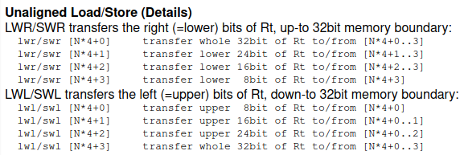

# R3000A CPU

## Architecture

- 32-bit MIPS CPU
- 33.8688 MHz Clock Speed
- Cache
    - Instr Cache: 4KB
    - Data Cache: 1KB
- Bus transfer reate of 132 MB/sec
- Two coprocessors
    - cop0: System Control
    - cop2: GPU (see GPU notes)

## Reset State

- PC = 0xbfc00000 (beginning of BIOS)

### Registers

#### General Purpose

| Register Number | Name | Usage |
| --- | --- | --- |
| R0  | ZR  | Constant Zero |
| R1  | AT  | Reserved for the assembler |
| R2-R3 | V0-V1 | Values for results and expression evaluation |
| R4-R7 | A0-A3 | Arguments |
| R8-R15 | T0-T7 | Temporaries (not preserved across call) |
| R16-R23 | S0-S7 | Saved (preserved across call) |
| R24-R25 | T8-T9 | More Temporaries (not preserved across calls) |
| R26-R27 | K0-K1 | Reserved for OS Kernel |
| R28 | GP  | Global Pointer |
| R29 | SP  | Stack Pointer |
| R30 | FP  | Frame Pointer |
| R31 | RA  | Return address (set by function call) |

#### Multiply/Divide Registers and Program Counter

| Name | Description |
| --- | --- |
| HI  | Multiplication 64 bit High result or division remainder |
| LO  | Multiplication 64 bit Low result or division quotient |
| PC  | Program Counter |

## Instruction Set

Fixed 32-bit instructions with 3 different types.

### I-Type

| op (6 bits) | rs (5 bits) | rt (5 bits) | imm (16 bits) |
| --- | --- | --- | --- |

### J-Type

| op (6 bits) | target (26 bits) |
| --- | --- |

### R-Type

| op (6 bits) | rs (5 bits) | rt (5 bits) | shamt (5 bits) | funct (6 bits) |
| --- | --- | --- | --- | --- |

### Key

| Term | Definition |
| --- | --- |
| op  | 6-bit operation code |
| rs  | 5-bit source register specifier |
| rt  | 5-bit target register or branch condition |
| imm | 16-bit immediate value or branch or address displacement |
| target | 26-bit jump target address |
| rd  | 5-bit destinatio register specifier |
| shamt | 5-bit shift amount |
| funct | 6-bit function field |

### Basic Instruction Groupings

#### Load/Store

- move data between memory and general registers.
- "I-Type" instructions

#### Computational

- perform arithmetic, logical, and shift ops
- "I-Type" instructions

#### Jump and Branch

- change flow of program
- "J-Type" or "R-Type" instructions

#### Co-Processor

- perform ops on the co-processor set
- "I-Type"
- In R3000A, the cop0 contains registers which are used in mem management and exception handling

#### Special

- perform a variety of tasks, including movement of data between special and general regs, sys calls, and breakpoint ops.
- "R-Type" instructions

## Instructions

[Source](http://hitmen.c02.at/files/docs/psx/psx.pdf)

### Load and Store Instructions

| Instruction | Format | Implementation | Description |
| --- | --- | --- | --- |
| Load Byte | LB rt, offset(base) | rt = BYTE\[offset + base\] | Sign-extend 16-bit offset and add to contents of register base to form address. *Sign-extend* contents of addressed byte and load into rt. |
| Load Byte Unsigned | LBU rt, offset(base) | rt = BYTE\[offset + base\] | Sign-extend 16-bit offset and add to contents of register base to form address. *Zero-extend* contents of addressed byte and load into rt. |
| Load Halfword | LH rt, offset(base) | rt = HALF\[offset + base\] | Sign-extend 16-it offset and add to contents of register base to form address. *Sign-extend* contents of addressed byte and load into rt. |
| Load Halfword Unsigned | LHU rt, offset(base) | rt = HALF\[offset + base\] | Sign-extend 16-bit offset and add to contents of register base to form address. *Zero-extend* contents of addressed byte and load into rt. |
| Load Word | LW rt, offset(base) | rt = WORD\[offset + base\] | Sign-extend 16-bit offset and add to contents of register base to form address. Load contents of addressed word into register. |
| Load Word Left | LWL rt, offset(base) | *See Notes* | Sign-extend 16-bit offset and add to base to form addr. Shift addressed word left so that addressed byte is leftmost byte of a word. Merge bytes from memory with contents of register rt and load result into register rt. |
| Load Word Right | LWR rt, offset(base) | *See Notes* | Sign-extend 16-bit offset and addt ot base to form addr. Shift addressed word right so that addressed byte is rightmost byte of a word. Merge bytes from memory with contents of register rt and load result into register rt. |
| Store Byte | SB rt, offset(base) | BYTE\[offset + base\] = rt & 0xFF | Sign-extend 16-bit offset and add to base to form addr. Store LSByte of register rt at mem location. |
| Store Halfword | SH rt, offset(base) | HALF\[offset + base\] = rt & 0xFFFF | Sign-extend 16-bit offset and add to base to form addr. Store LSHalfword of register rt at addressed location. |
| Store Word | SW rt, offset(base) | WORD\[offset + base\] = rt & 0xFFFF_FFFF | Sign-extend 16-bit offset and add to base to form addr. Store rt into mem location. |
| Store Word Left | SWL rt, offset(base) | *See Notes* | Sign-extend 16-bit offset and add to base to form address. Shift contents of register rt right so that leftmost byte of the word is in position of addressed byte. Store bytes containing original data into corresponding bytes at addressed byte. |
| Store Word Right | SWR rt, offset(base) | *See Notes* | Sign-extend 16-bit offset and add to base to form address. Shift contents of register rt left so that righmost byte of the word is in poisition addressed byte. Store bytes containing original data into correspoinding bytes at addressed byte. |

NOTES:

- Halfword addresses must be aligned by 2
- Word addresses must be aligned by 4
- Trying to access mis-aligned addresses will cause an exception  
    

### Computational Instructions

| Instruction | Format | Implementation | Description |
| --- | --- | --- | --- |
| ADD Immediate | ADDI rt, rs, imm | rt = rs + imm | Add 16-bit extended immediate to register rs and place 32-bit result in register rt. **Trap on two's complement overflow.** |
| ADD Immediate Unsigned | ADDIU rt, rs, imm | rt = rs + imm | Add 16-bit extended immediate to register rs and place 32-bit result in rt. **No Trap.** |
| Set on Less Than Immediate | SLTI rt, rs, imm | rt = rs < imm | Compare 16-bit sign-extended imm with register rs as signed 32-bit int. Result = 1 if rs is less than imm; otherwise result = 0. Place result in register rt. **Trap on overflow??** |
| Set on Less Than Unsigned Immediate | SLTIU rt, rs, imm | rt = rs < imm | Compare 16-bit sign-extended imm with register rs as unsigned 32-bit int. Result = 1 if rs is less than imm; otherwise result = 0. Place result in register rt. **Do not trap on overflow.** |
| AND Immediate | ANDI rt, rs, imm | rt = rs & imm | *Zero-extend* 16-bit imm, AND with register rs and place result in register rt. |
| OR Immediate | ORI rt, rs, imm | rt = rs \| imm | *Zero-extend* 16-bit imm, OR with contents of register rs and place result in register rt. |
| Exclusive OR Immediate | XORI rt, rs, imm | rt = rs ^ imm | *Zero-extend* 16-bit imm, exclusive OR with contents of rs and place in register rt. |
| Load Upper Immediate | LUI rt, imm | rt \|= (imm << 16) & 0xFF00 | Shift 16-bit imm left 16 bits. Set least significant 16 bits of word to zeroes. Store result in register rt. |

NOTES:

- On trap, trigger exception and don't store result of op

### Three Operand Register-Type Operations

| Instruction | Format | Implentation | Description |
| --- | --- | --- | --- |
| ADD | ADD rd, rs, rt | rd = rs + rt | Add contents of registers rs and rt and place result in register rd. **Trap on two's complement overflow.** |
| ADD Unsigned | ADDU rd, rs, rt | rd = rs + rt | Add contents of registers rs and rt and place 32-bit result in register rd. **Do not trap on overflow.** |
| Subtract | SUB rd, rs, rt | rd = rs - rt | Subtract contents of registers rt and rs and place 32-bit result in register rd. **Trap on two's complement overflow** |
| Subtract Unsigned | SUBU rd, rs, rt | rd = rs - rt | Subtract contents of registers rt and rs and place result in rd. **Do not trap on overflow** |
| Set on Less Than | SLT rd, rs, rt | rd = rs < rt | Compare contents of rt to rs (as signed 32-bit int). if rs is less than rt, result = 1; otherwise, result = 0 |
| Set on Less Than Unsigned | STLU rd, rs, rt | rd = rs < rt | Compare rt to rs (as unsigned 32-bit int). If rs is less than rt, result = 1; otherwise result = 0. |
| AND | AND rd, rs, rt | rd = rs & rt | Bit-wise AND contents of registers rs and rt and place result in register rd. |
| OR  | OR rd, rs, rt | rd = rs \| rt | Bit-wise OR contents of registers rs and rt and store in rd. |
| Exclusive OR | XOR rd, rs, rt | rd = rs ^ rt | Bit-wise Exclusive OR contents of registers rs and rt and store in rd |
| NOR | NOR rd, rs, rt | rd = ~(rs \| rt) | Bit-wise NOR contents of registers rs and rt and store in rd. |

### Shift Operations

| Instruction | Format | Implementation | Description |
| --- | --- | --- | --- |
| Shift Left Logical | SLL rd, rt, shamt | rd = rt << shamt | Shift contents of register rt left by shamt bits, inserting 0's into low order bits. Place 32-bit result in register rd. |
| Shift Right Logical | SRL rd, rt, shamt | rd = rt >> shamt | Shift contents of rt right by shamt bits, inserting zeroes into high order bits. Place 32-bit result in register rd. |
| Shift Right Arithmetic | SRA rd, rt, shamt | rd = rt >> shamt | Shift contents of rt right by shamt bits, sign-extending the high order bits. Place 32-bit result in register rd. |
| Shift Left Logical Variable | SLLV rd, rt, rs | rd = rt << (rs & 0x1F) | Shift rt right. Low-order 5 bits of egister rs specify number of bits to shift. Insert zeroes into low order bits of rt and place 32-bit result in register rd. |
| Shift Right Logical Variable | SRLV rd, rt, rs | rd = rt << (rs & 0x1F) | Shift contents of register rt right. Low-order 5 bits of rs specify number of bits to shift. Insert zeroes into high order bits of rt and place 32-bit result in register rd. |
| Shift Right Arithmetic Variable | SRAV rd, rt, rs | rd = rt << (rs & 0x1F) | Shift contents of register rs right. Low-order 5 bits of rs specify number of bits to shift. Sign-extend the high order bits of rt and place 32-bit result in register rd. |

### Multiply and Divide Operations

| Instruction | Format | Implementation | Description |
| --- | --- | --- | --- |
| Multiply | MULT rs, rt | HI/LO = rs * rt | Multiply contents of registers rs and rt as two's complement values. Place 64-bit result in special registers HI/LO. |
| Multiply Unsigned | MULTU rs, rt | HI/LO = rs * rt | Multiply contents of registers rs and rt as unsigned values. Place 64-bit result in special registers HI/LO. |
| Divide | DIV rs, rt | LO = rs / rt, HI = rs % rt | Divide contents of register rs by rt treating operands as two's complements values. Place 32-bit quotient in special register LO, and 32-bit remainder in HI. |
| Divide Unsigned | DIVU rs, rt | LO = rs / rt, HI = rs % rt | Divide contents of register rs by rt treating operands as unsigned values. Place 32-bit quotient in special register LO, and 32-bit remainder in HI. |
| Move From HI | MFHI rd | rd = HI | Move contents of special register HI to register rd. |
| Move From LO | MFLO rd | rd = LO | Move contents of special LO to register rd. |
| Move to HO | MTHI rd | HI = rd | Move contents of special register HI to register rd. |
| Move to LO | MTLO rd | LO = rd | Move contents of special register LO to register rd. |

### Jump and Branch Instruction

| Instruction | Format | Implementation | Description |
| --- | --- | --- | --- |
| Jump | J target | pc = (pc & 0xF000_0000) \| (target << 2) | Shift 26-bit target address left two bits, combine with high-order 4 bits of PC and jump to address with aone instruction delay. |
| Jump and Link | JAL target | pc = (pc & 0xF000_0000) \| (target << 2) | Shift 26-bit target address left two bits, ocmbine with high-order 4 bits of PC and jump to address with a one instruction delay. Place address of instruction following delay slot in r31 (link register). |
| Jump Register | JR rs | pc = rs | Jump to address contained in register rs with a one instruction delay. |
| Jump and Link Register | JALR rs, rd | rd = pc; pc = rs | Jump to address contained in register rs with a one instruction delay. Place address of instruction following delay slot in rd. |
| Branch on Equal | BEQ rs, rt, offset | if rs == rt then branch | Branch to target address if register rs equal to rt |
| Branch on Not Equal | BNE rs, rt, offset | if rs != rt then branch | Branch to target address if register rs does not equal rt |
| Branch on Less than or Equal Zero | BLEZ rs, offset | if rs <= 0 then branch | Branch to target if regiser rs less than or equal to 0. |
| Branch on greater Than Zero | BGTZ rs, offset | if rs >= 0 then branch | Branch to target address if register rs greater than or equal to 0. |
| Branch on Less Than Zero And Link | BLTZAL rs, offset | if rs < 0 then branch and link | Place address of nstruction following delay slot in register r31 (link register). Branch to target address if register rs less than 0. |
| Branch on greater than or Equal Zero And Link | BGEZAL rs, offset | if rs >= 0 then branch and link | Place address of instruction following delay slot in register r31 (link register). Branch to target address if register rs is greater than or equal to 0. |

NOTES:

- All Branch instruction target addresses are computed as follows:
    - Add address of instruction in delay slot and the 16-bit offset (shifted left two bits and sign-extended to 32 bits). All branches occur with a delay of one instruction.

### Special Instructions

| Instruction | Format | Implementation | Description |
| --- | --- | --- | --- |
| System Call | SYSCALL | *See PSX SYSCALL Routines* | Initiates system call trap, immediately transferring control to exception handler. |
| Breakpoint | BREAK | Need breakpoint trap handler | Initialtes breakpoint trap, immediately transferring control to exception handler. |

### Co-processor Instruction

| Instruction | Format | Implementation | Description |
| --- | --- | --- | --- |
| Load Word to Co-processor | LWCz rt, offset(base) | Cz.rt = WORD\[offset + base\] | Sign-extend 16-bit offset and add to base to form address. Load contents of addressed word into co-processor register rt of co-processor unit z. |
| Store Word from Co-processor | SWCz rt, offset(base) | WORD\[offset + base\] = Cz.rt | Sign-extend 16-bit offset and add to base to form address. Store contents of co-processor register rt from co-processor unit z at addressed memory word. |
| Move To Co-processor | MTCz rt, rd | Cz.rd = rt | Move contents of CPU register rt into co-processor register rd of co-processor unit z. |
| Move from Co-processor | MFCz rt, rd | rt = Cz.rd | Move contents of co-processor register rd from co-processor unit z to CPU register rt. |
| Move Control to Co-processor | CTCz rt, rd | Cz.rd = rt | Move contents of CPU register rt into co-processor control register rd of co-processor unit z. |
| Move Control From Co-processor | CFCz rt, rd | rt = Cz.rd | Move contents of control register rd of co-processor unit z into CPU register rt. |
| Move Control From Co-processor | COPz cofun | ??? | Co-processor z performs an operation. The state of the R3000A is not modified by a co-processor operation. |

NOTES:

- Make sure you understand the nuance of these instructions. May need to read other sections.

### System Control Co-processor (COP0) Instructions

| Instruction | Format | Implementation | Description |
| --- | --- | --- | --- |
| Move To CP0 | MTC0 rt, rd | C0.rd = rt | Store contents of CPU register rt into register rd of CP0. This follows the convention of store operations. |
| Move From CP0 | MFC0 rt, rd | rt = C0.rd | Load CPU register rt with contents of CP0 register rd. |
| Read Indexed TLB Entry | TLBR | ??? | Load EntryHi and EntryLo registers with TLB entry pointed at by Index register. |
| Write Indexed TLB Entry | TLBWI | ??? | Load TLB entry pointed at by Index register with contents of EntryHi and EntryLo. |
| Write Random TLB Entry | TLBWR | ??? | Load TLB entry pointed at by Random register with contents of EntryHi and EntryLo registers. |
| Probe TLB for Matching Entry | TLBP | ??? | Entry Load Index register address of TLB entry whose contents match EntryHi and EntryLo. If no TLB entry matches, set high-order bit of Index register. |
| Restore From Exception | RFE | ??? | Restore previous interrupt mask and mode bits of status register into current status bits. Restore old status bits into previous status bits. |

## Opcode Encoding

[source](http://problemkaputt.de/psx-spx.htm#cpualuopcodes)

- 67 Opcodes
- Opcodes marked with "N/A" caus ea Reserved Instruction Exception

### Primary opcode field (Bits 26..31)

```
00 = SPECIAL  08 = ADDI   10 = COP0  18 = N/A  20 = LB   28 = SB   30 = LWC0  38 = SWC0
01 = BcondZ   09 = ADDIU  11 = COP1  19 = N/A  21 = LH   29 = SH   31 = LWC1  39 = SWC1
02 = J        0A = SLTI   12 = COP2  1A = N/A  22 = LWL  2A = SWL  32 = LWC2  3A = SWC2
03 = JAL      0B = SLTIU  13 = COP3  1B = N/A  23 = LW   2B = SW   33 = LWC3  3B = SWC3
04 = BEQ      0C = ANDI   14 = N/A   1C = N/A  24 = LBU  2C = N/A  34 = N/A   3C = N/A
05 = BNE      0D = ORI    15 = N/A   1D = N/A  25 = LHU  2D = N/A  35 = N/A   3D = N/A
06 = BLEZ     0E = XORI   16 = N/A   1E = N/A  26 = LWR  2E = SWR  36 = N/A   3E = N/A
07 = BGTZ     0F = LUI    17 = N/A   1F = N/A  27 = N/A  2F = N/A  37 = N/A   3F = N/A
```

### Secondary opcode field (bit 0..5) (when Primary opcode = 00)

```
00 = SLL   08 = JR....   10 = MFHI  18 = MULT.  20 = ADD.  28 = N/A.  30 = N/A  38 = N/A
01 = N/A   09 = JALR     11 = MTHI  19 = MULTU  21 = ADDU  29 = N/A   31 = N/A  39 = N/A
02 = SRL   0A = N/A      12 = MFLO  1A = DIV    22 = SUB   2A = SLT   32 = N/A  3A = N/A
03 = SRA   0B = N/A      13 = MTLO  1B = DIVU   23 = SUBU  2B = SLTU  33 = N/A  3B = N/A
04 = SLLV  0C = SYSCALL  14 = N/A   1C = N/A    24 = AND   2C = N/A   34 = N/A  3C = N/A
05 = N/A   0D = BREAK    15 = N/A   1D = N/A    25 = OR    2D = N/A   35 = N/A  3D = N/A
06 = SRLV  0E = N/A      16 = N/A   1E = N/A    26 = XOR   2E = N/A   36 = N/A  3E = N/A
07 = SRAV  0F = N/A      17 = N/A   27 = N/A    27 = NOR   2F = N/A   37 = N/A  3F = N/A
```


